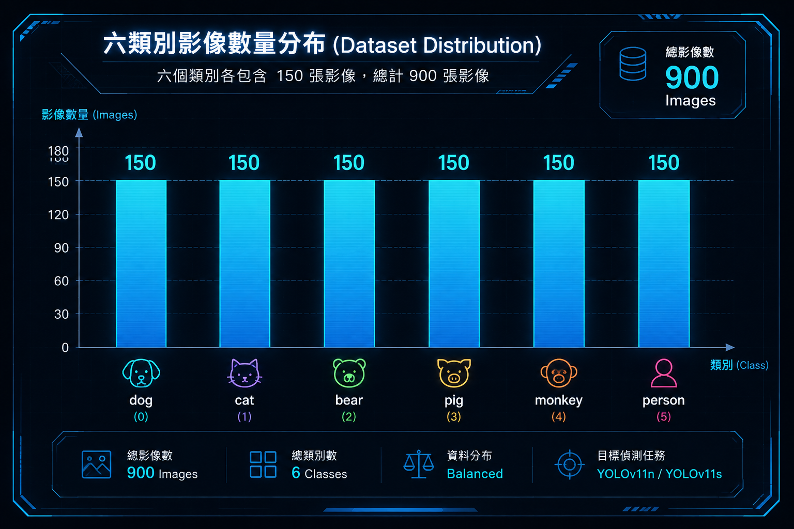
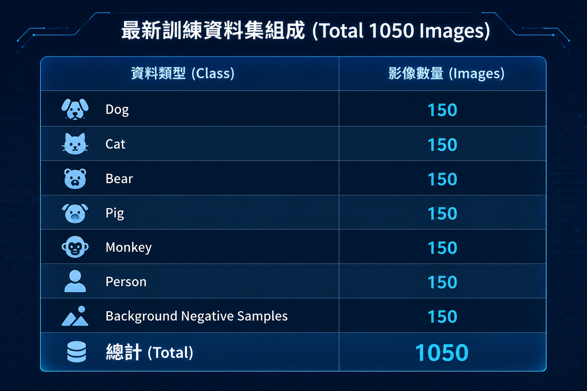

# 🐻 YOLOv11n-vs-YOLOv11s-Object-Detection

## 📌 專案背景與研究動機 (Research Background and Motivation)

本研究以 YOLOv11 系列模型作為物件偵測研究基礎，主要探討不同模型規模在多類別物件偵測任務中的辨識效能。

研究初期先以三種類別「狗（Dog）、貓（Cat）、熊（Bear）」建立物件偵測資料集，透過實際訓練結果觀察模型的辨識能力，並進一步分析資料量與模型效能之間的關係。

在初期實驗完成後，進一步增加各類別的影像數量，將每一類別由 100 張擴充至 150 張，藉此觀察增加訓練資料後對模型 Precision、Recall、mAP50 及 mAP50-95 等指標所造成的影響。

經過前期三類別模型的建立與資料量擴充後，本研究再進一步將資料集擴充至六種類別，並使用 YOLOv11n 與 YOLOv11s 進行模型比較，搭配五折交叉驗證（5-Fold Cross Validation）提升實驗結果的可靠性。

後續研究則以六類別模型為核心，透過模型參數優化與背景負樣本擴充，逐步建立適合後續實際部署之 YOLO 物件偵測模型。

# 🧩 YOLOv11n-vs-YOLOv11s-3Class-Object-Detection

## 🧩 前期三類別模型建立 (Initial Three-Class Model Development)

本研究第一階段先建立三類別物件偵測資料集，選定以下三種類別作為初期研究對象：

| 類別 | 英文名稱 | 第一次實驗資料量 |
| --- | --- | ---: |
| 狗 | Dog | 100 張 |
| 貓 | Cat | 100 張 |
| 熊 | Bear | 100 張 |
| **總計** | - | **300 張** |

資料集建立後，使用 Label Studio 進行影像標註，並將完成的標註資料轉換為 YOLO 格式，建立對應的影像與標註檔案。

第一階段主要目的為建立完整的物件偵測流程，包含：

- 影像資料蒐集與整理
- 資料標註
- YOLO 格式資料建立
- 模型訓練
- 驗證與效能評估

透過第一次三類別模型訓練結果，作為後續資料量擴充與模型優化的基礎。

## 🔧 三類別模型實驗與優化 (Three-Class Model Experiment and Optimization)

完成第一次三類別模型訓練後，進一步針對資料量進行擴充，以觀察增加訓練資料對模型偵測效能的影響。

第二次實驗將三種類別的資料量由每類別 100 張增加至 150 張：

| 類別 | 英文名稱 | 第一次實驗 | 第二次實驗 | 增加數量 |
| --- | ---: | ---: | ---: | ---: |
| 狗 | Dog | 100 張 | 150 張 | +50 張 |
| 貓 | Cat | 100 張 | 150 張 | +50 張 |
| 熊 | Bear | 100 張 | 150 張 | +50 張 |
| **總計** | - | **300 張** | **450 張** | **+150 張** |

第二次實驗主要目的為探討資料量增加後，模型在物件特徵學習與偵測能力上的變化。

透過比較兩次實驗的 Precision、Recall、mAP50 與 mAP50-95，可以分析資料量增加是否能有效提升模型整體效能，並作為後續六類別資料集擴充與模型實驗的重要依據。

### 🔄 三類別模型優化與研究方向調整 (Optimization and Research Transition)

在三類別研究階段，YOLOv11n 完成初期模型訓練與效能評估後，由於後續專題研究方向進一步確立為 **六類別目標偵測**，因此未再針對三類別 YOLOv11n 進行後續優化。

YOLOv11s 則於三類別研究階段進一步進行模型優化實驗，作為前期模型參數調整與效能改善的研究參考。

隨著研究方向確立，後續模型訓練、參數優化、五折交叉驗證及實際影片測試，主要集中於本研究核心的 **六類別 YOLOv11n 與 YOLOv11s 模型**。

> **因此，本專案保留 YOLOv11n 三類別初期模型作為前期研究紀錄，但不另外建立 YOLOv11n 三類別優化版本；後續模型優化與部署研究則以六類別模型為主要研究方向。**

# 🐻 YOLOv11n-vs-YOLOv11s-6Class-Object-Detection

## 📈 六類別資料集擴充 (Six-Class Dataset Expansion)

完成前期三類別物件偵測模型的建立與資料量擴充後，本研究進一步將資料集由原本的三種類別擴充至六種類別，增加模型需要辨識的物件種類，並逐步增加各類別的資料量，以建立較完整且具代表性的物件偵測資料集。

前期三種類別為 **Dog、Cat、Bear**，後續新增 **Pig、Monkey、Person** 三種類別，使研究由三類別物件偵測進一步擴展至六類別物件偵測。

### 🗂️ 資料集擴充歷程 (Dataset Expansion History)

| 實驗階段 | Dog | Cat | Bear | Pig | Monkey | Person | Background | 總影像數 |
| --- | ---: | ---: | ---: | ---: | ---: | ---: | ---: | ---: |
| 第一次三類別 | 100 | 100 | 100 | - | - | - | - | **300** |
| 第二次三類別 | 150 | 150 | 150 | - | - | - | - | **450** |
| 六類別初期 | 150 | 150 | 150 | 100 | 100 | 100 | - | **750** |
| 六類別完整資料集 | 150 | 150 | 150 | 150 | 150 | 150 | - | **900** |
| 第二次優化資料集 | 150 | 150 | 150 | 150 | 150 | 150 | 150 | **1050** |

透過上述資料集擴充流程，研究逐步由 **3 類別、300 張影像**發展至 **6 類別、900 張目標樣本**，並於後續第二次模型優化階段新增 **150 張背景負樣本（Background Negative Samples）**，使最新訓練資料集擴充至 **1050 張影像**。

> **注意：Background 為背景負樣本，並非第 7 個偵測類別，因此模型仍維持 6 個正式偵測類別。**

### 📊 六類別資料分布 (Six-Class Dataset Distribution)

六類別目標資料集包含 **Dog、Cat、Bear、Pig、Monkey、Person** 六個類別，每個類別皆包含 **150 張影像**，共計 **900 張目標樣本**。

| Class ID | 類別名稱 | 中文名稱 | 影像數量 |
| ---: | --- | --- | ---: |
| 0 | Dog | 狗 | 150 |
| 1 | Cat | 貓 | 150 |
| 2 | Bear | 熊 | 150 |
| 3 | Pig | 豬 | 150 |
| 4 | Monkey | 猴 | 150 |
| 5 | Person | 人 | 150 |
| **總計** | **6 Classes** | - | **900** |

  

  <b>圖1　六類別資料集影像數量分布</b>

由資料分布可看出，Dog、Cat、Bear、Pig、Monkey 及 Person 六個類別皆包含 **150 張影像**，各類別資料數量維持一致。

透過建立類別數量均衡的資料集，可降低因不同類別樣本數量差異所造成的 **Class Imbalance（類別不平衡）**問題，使 YOLOv11n 與 YOLOv11s 能在相同且較公平的資料條件下進行模型訓練與效能比較。

此 **6 類別、每類 150 張、共 900 張目標樣本**的資料集作為 YOLOv11n 與 YOLOv11s 六類別模型建立、五折交叉驗證及模型優化的主要實驗基礎。

### 🛠️ 資料集建立流程 (Dataset Construction Process)

六類別資料集建立過程包含：

- 蒐集各類別影像資料
- 篩選與整理影像
- 使用 **Label Studio** 進行物件標註
- 確認標註類別與 Class ID
- 將標註資料轉換為 YOLO 格式
- 建立影像與標註檔案的對應關係
- 檢查資料集完整性與標註正確性

完成六類別資料集後，以 **900 張影像、6 個物件類別**作為 YOLOv11n 與 YOLOv11s 模型比較的主要資料集，並透過 **5-Fold Cross Validation** 進行模型效能評估。

模型主要比較 **Precision、Recall、mAP50 與 mAP50-95**，分析 YOLOv11n 與 YOLOv11s 在相同六類別資料集下的偵測效能與穩定性。

## 🌲 背景負樣本擴充 (Background Negative Sample Expansion)

完成六類別模型建立與前期模型優化後，為進一步改善模型在自然環境中的背景誤判問題，本研究於後續優化階段新增 **150 張背景負樣本（Background Negative Samples）**。

背景負樣本主要涵蓋森林、山景、山林、草地、灌木、岩石及溪流等自然環境，並兼顧白天與夜晚不同光線條件。

- ☀️ **白天背景：75 張**
- 🌙 **夜晚背景：75 張**
- 🎯 **六類別目標樣本：900 張**
- 🌲 **背景負樣本：150 張**
- 📊 **最新資料集總數：1050 張**

背景負樣本中不包含 Dog、Cat、Bear、Pig、Monkey、Person 六個偵測目標，主要用於降低模型將樹木、岩石、陰影、草叢等自然背景誤判為目標物件的情況。

> **Background Negative Samples 僅作為無目標物件的背景訓練資料，並未新增 Class ID，因此 YOLO 模型仍維持 6 個正式偵測類別。**

### 🎯 最新訓練資料集 (Latest Training Dataset)

經過前期三類別模型建立、資料量擴充、六類別資料集建立及背景負樣本擴充後，目前最新訓練資料集包含 **900 張六類別目標樣本與 150 張背景負樣本，共計 1050 張影像**。

  

  <b>圖 2　最新訓練資料集組成（1050 張影像）</b>

因此，本研究資料集發展歷程如下：

**300 張（三類別）**  
→ **450 張（三類別擴充）**  
→ **750 張（六類別初期）**  
→ **900 張（六類別完整目標資料）**  
→ **1050 張（六類別 + 背景負樣本）**

目前最新研究階段以 **1050 張影像**進行模型優化與五折交叉驗證，進一步分析加入背景負樣本前後的模型效能變化。

## 🔀 資料切分方式 (Data Split Strategy)

本研究於六類別模型建立與前期優化階段，使用 **900 張目標樣本**進行模型訓練與五折交叉驗證，包含 6 個正式偵測類別，每類各 150 張。

於背景負樣本優化階段，再加入 **150 張背景負樣本（Background Negative Samples）**，使最新資料集增加至 **1050 張影像**，並重新進行五折交叉驗證，以比較加入背景負樣本前後的模型效能變化。

### 📊 五折交叉驗證 (5-Fold Cross Validation)

模型採用 **5-Fold Cross Validation** 進行訓練與驗證：

- `n_splits = 5`
- `shuffle = True`
- `random_state = 42`

在原始 **900 張六類別資料集**的五折交叉驗證中：

- 每個 Fold 約 **80%（720 張）作為訓練資料**
- 每個 Fold 約 **20%（180 張）作為驗證資料**

  

  <b>圖 3　5-Fold Cross Validation 單一 Fold 資料切分比例</b>

在五折交叉驗證中，資料集被劃分為 **5 個 Fold**。每次使用其中 **4 個 Fold 作為訓練資料（80%）**，剩餘 **1 個 Fold 作為驗證資料（20%）**，並輪流更換驗證 Fold。

經過五次訓練後，每張影像皆會作為驗證資料一次，並於其餘四次訓練中作為訓練資料，最後以五次驗證結果的平均值作為模型整體效能評估依據。

加入背景負樣本後，則以最新的 **1050 張影像資料集**重新進行五折交叉驗證，作為模型優化前後效能比較的依據。

### 🧪 測試資料 (Test Data)

本研究另外準備獨立測試影像進行模型推論測試，測試圖片不參與模型的訓練與五折交叉驗證。

測試階段未直接使用原始資料集中的影像，主要是為避免模型對訓練或驗證過程中曾使用的影像產生較熟悉的辨識結果，造成模型實際泛化能力被高估。

因此，本研究使用模型訓練與驗證階段未使用過的影像進行測試，以觀察模型面對新影像時的實際辨識能力，更貼近後續模型部署於真實環境時可能遇到的情況。

測試影像涵蓋 Dog、Cat、Bear、Pig、Monkey 及 Person 六個類別，主要觀察模型的類別辨識、Bounding Box 定位及 Confidence Score 表現，作為後續最終部署模型建立與實際應用測試之參考。

## 🚀 最終 YOLO 模型部署 (Final YOLO Model Deployment)

完成 YOLOv11n 與 YOLOv11s 的模型訓練、五折交叉驗證與優化後，本研究將根據實驗結果綜合評估 **Precision、Recall、mAP50、mAP50-95** 等指標，分析不同模型與訓練參數對偵測效能的影響。

在研究與比較階段，透過五折交叉驗證評估模型在不同資料切分下的穩定性與泛化能力，並搭配實際影像與影片推論結果觀察模型的偵測表現。

完成模型優化與比較後，將根據實驗結果選定適合的 YOLO 模型與訓練參數，建立最終部署模型。

最終 YOLO 模型將負責辨識以下六種類別：

- Dog
- Cat
- Bear
- Pig
- Monkey
- Person

本研究所建立的 YOLO 模型將作為整體**黑熊智慧警示系統中的物件偵測模組**，負責從影像中辨識動物與人員，並將物件偵測結果提供給整體系統後續模組使用。

> **本專案儲存庫主要記錄本人負責之 YOLO 物件偵測研究與實作；LLM 情境分析屬於整體黑熊智慧警示系統架構的一部分，並非本專案儲存庫主要研究內容。**

## 🧭 YOLO 模型研究流程 (YOLO Research Workflow)

本研究由前期三類別模型逐步發展至六類別模型，並透過資料集擴充、五折交叉驗證、模型比較、參數優化與背景負樣本加入，逐步建立供整體黑熊智慧警示系統使用的 YOLO 物件偵測模型。

整體 YOLO 研究流程如下：

**資料集建立與整理**  
↓  
**三類別初期模型（300 張）**  
↓  
**三類別資料擴充（450 張）**  
↓  
**六類別初期資料集（750 張）**  
↓  
**六類別完整資料集（900 張）**  
↓  
**YOLOv11n / YOLOv11s 模型訓練**  
↓  
**5-Fold Cross Validation**  
↓  
**模型效能比較與參數優化**  
↓  
**新增 150 張背景負樣本**  
↓  
**建立 1050 張最新訓練資料集**  
↓  
**重新進行模型優化與五折交叉驗證**  
↓  
**實際影像與影片推論測試**  
↓  
**選定最終 YOLO 模型與訓練參數**  
↓  
**建立最終 YOLO 部署模型**  
↓  
**提供整體黑熊智慧警示系統使用**
