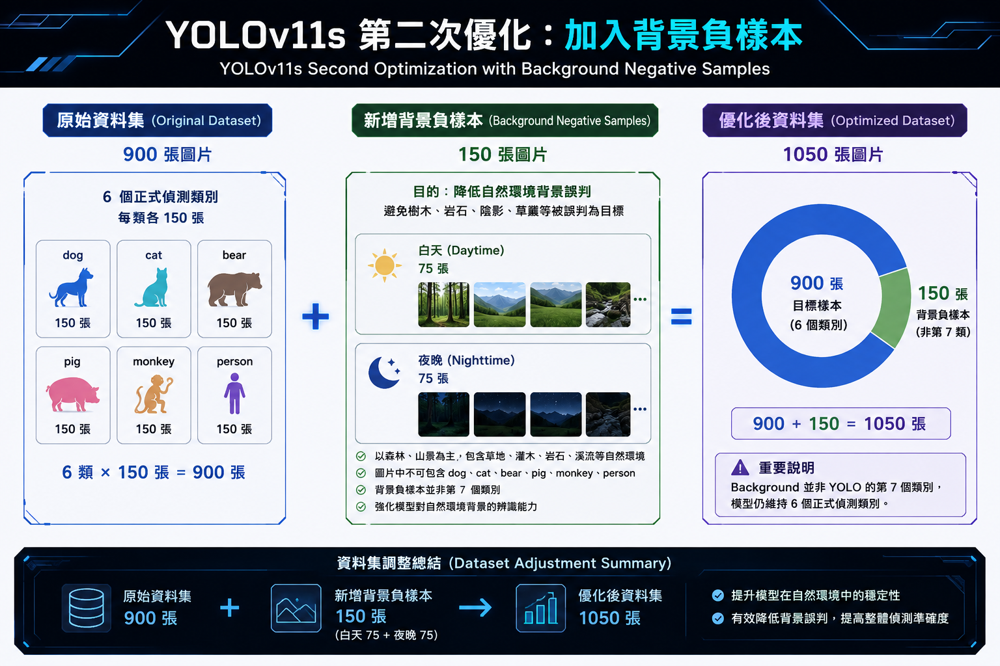

# YOLOv11n 第二次優化（Second Optimization）
### YOLOv11n Second Optimization with Background Negative Samples

## 📌 1. 優化說明（Optimization Overview）

本階段為 YOLOv11n 六類別模型的第二次優化，主要針對模型在自然環境中的背景誤判問題進行改善。

透過新增背景負樣本（Background Negative Samples），強化模型對森林、山景及其他自然環境背景的辨識能力，以降低樹木、岩石、陰影及草叢等背景被誤判為目標物件的情況。

### ⚙️ 訓練參數設定（Training Parameter Settings）

第二次優化沿用第一次優化所採用的訓練參數，其中 **cls=0.75**，其餘主要訓練設定維持不變，主要調整項目為加入背景負樣本。

透過維持相同的模型與訓練參數，使兩次優化結果具有較一致的比較基準，進一步觀察新增背景負樣本對 YOLOv11n 模型效能的影響。

## 📊 2. 資料集調整（Dataset Adjustment）

原始資料集共有 **900 張目標樣本**，包含 6 個正式偵測類別，每個類別各 150 張圖片。

第二次優化新增 **150 張背景負樣本（Background Negative Samples）**，使資料集總數增加至 **1050 張圖片**。

> **注意：Background 並非第 7 個偵測類別，模型仍維持 6 個正式偵測類別。**

## 🌲 3. 背景負樣本設計（Background Negative Sample Design）

為提升模型對自然環境背景的辨識能力，本次新增 **150 張背景負樣本（Background Negative Samples）**，並兼顧不同光線與環境條件。

- ☀️ **白天背景：75 張**
- 🌙 **夜晚背景：75 張**
- 🌲 **主要場景：**森林、山景及山林環境
- 🪨 **其他場景：**草地、灌木、岩石、溪流等自然環境
- 🚫 **樣本限制：**圖片中不包含 dog、cat、bear、pig、monkey、person 六個偵測類別

背景負樣本主要用於降低模型將 **樹木、岩石、陰影、草叢等自然背景誤判為目標物件**的情況。

## 📈 4. 五折交叉驗證（5-Fold Cross Validation）

為評估加入背景負樣本後的模型效能，本次以 **YOLOv11n（cls=0.75）** 重新進行五折交叉驗證，並以 Precision、Recall、mAP50 與 mAP50-95 作為主要評估指標。

本次五折交叉驗證使用 **1050 張影像**，包含 900 張六類別目標樣本與 150 張背景負樣本。

每個 Fold 的資料配置如下：

- **Training：840 張**
  - 目標樣本：720 張
  - 背景負樣本：120 張
- **Validation：210 張**
  - 目標樣本：180 張
  - 背景負樣本：30 張

| 折數（Fold） | Precision | Recall | mAP50 | mAP50-95 |
|:---:|:---:|:---:|:---:|:---:|
| Fold 1 | 0.8810 | 0.9220 | 0.9300 | 0.7790 |
| Fold 2 | 0.9460 | 0.8740 | 0.9280 | 0.7540 |
| Fold 3 | 0.9080 | 0.9240 | 0.9450 | 0.8090 |
| Fold 4 | 0.9400 | 0.8980 | 0.9160 | 0.7520 |
| Fold 5 | 0.9050 | 0.9480 | 0.9550 | 0.8090 |
| **五折平均（Mean）** | **0.9160** | **0.9132** | **0.9348** | **0.7806** |

## 🔍 5. 優化結果比較（Optimization Comparison）

為評估加入背景負樣本後的模型效能變化，將第一次優化與第二次優化的 **5-Fold 平均結果**進行比較。

| 評估指標 | 第一次優化 | 第二次優化 | 變化 |
|:---:|:---:|:---:|:---:|
| Precision | 0.9068 | **0.9160** | 🟢 ↑ +0.0092 |
| Recall | 0.9088 | **0.9132** | 🟢 ↑ +0.0044 |
| mAP50 | **0.9458** | 0.9348 | 🔴 ↓ -0.0110 |
| mAP50-95 | **0.7874** | 0.7806 | 🔴 ↓ -0.0068 |

### 📌 比較結果（Comparison Results）

- 🎯 **Precision 提升**：由 0.9068 提升至 0.9160，增加 **0.0092**。
- 📈 **Recall 提升**：由 0.9088 提升至 0.9132，增加 **0.0044**。
- 📉 **mAP50 小幅下降**：由 0.9458 降至 0.9348，減少 **0.0110**。
- 📉 **mAP50-95 小幅下降**：由 0.7874 降至 0.7806，減少 **0.0068**。

### 💡 結果分析（Result Analysis）

第二次優化後，Precision 與 Recall 均有所提升，其中 Precision 由 0.9068 提升至 0.9160，Recall 則由 0.9088 提升至 0.9132，顯示模型在預測準確性與目標偵測能力方面皆有所改善。

另一方面，mAP50 與 mAP50-95 分別下降 0.0110 與 0.0068。由於目前僅能從五折交叉驗證結果觀察整體效能變化，因此不直接將 mAP 指標的下降歸因於背景負樣本的加入。

後續將搭配實際影片偵測結果，進一步觀察模型在自然環境中的背景誤判情況，並評估新增背景負樣本後的實際偵測表現。

## ✅ 6. 結論（Conclusion）

第二次優化沿用第一次優化的訓練參數 **cls=0.75**，並維持其他主要訓練設定不變，主要透過新增 **150 張背景負樣本**進行優化，使資料集由 900 張增加至 1050 張。

與第一次優化相比，第二次優化的 5-Fold 平均結果如下：

- 🟢 **Precision：** 0.9068 → **0.9160**（↑ 0.0092）
- 🟢 **Recall：** 0.9088 → **0.9132**（↑ 0.0044）
- 🔴 **mAP50：** 0.9458 → **0.9348**（↓ 0.0110）
- 🔴 **mAP50-95：** 0.7874 → **0.7806**（↓ 0.0068）

整體而言，在維持原有訓練參數的情況下加入背景負樣本後，**Precision 與 Recall 均有所提升**，顯示模型在預測準確性與目標偵測能力方面取得改善；mAP50 與 mAP50-95 則出現小幅下降。

目前五折交叉驗證結果顯示模型整體效能仍維持穩定，但僅透過驗證指標尚無法直接判定背景誤判問題是否獲得改善。因此，後續將透過實際影片測試，進一步比較第一次與第二次優化模型在自然環境中的偵測表現，確認背景負樣本對降低誤判的實際效果。
