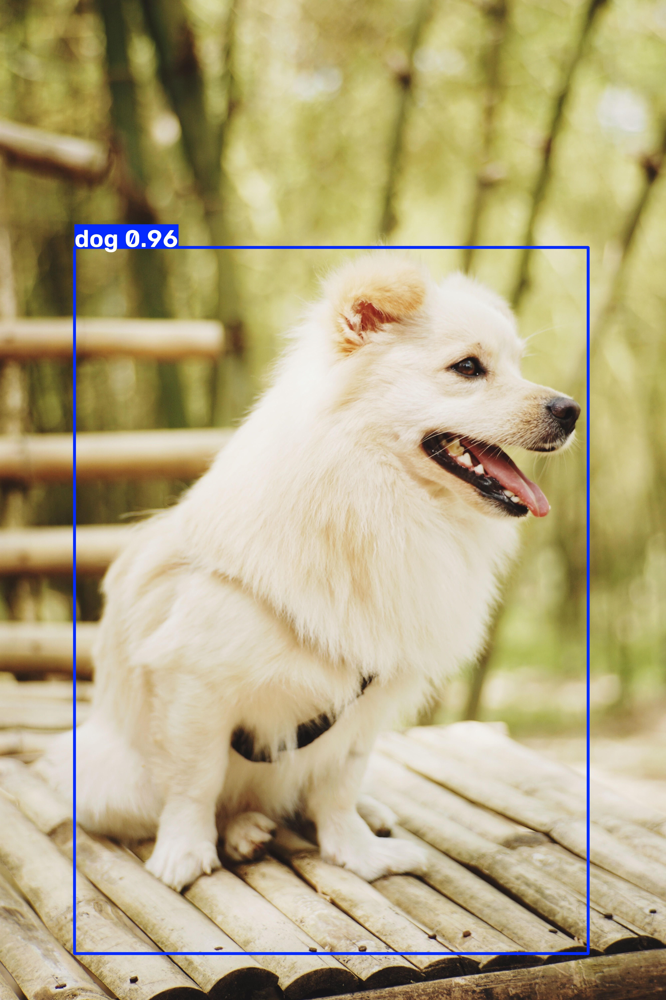
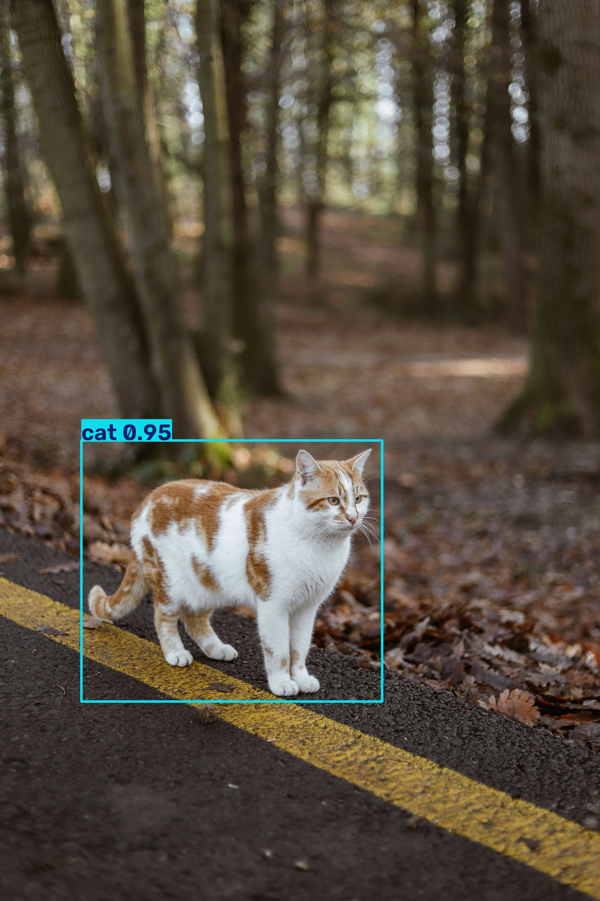
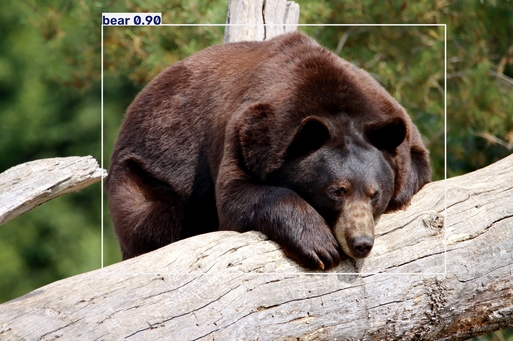
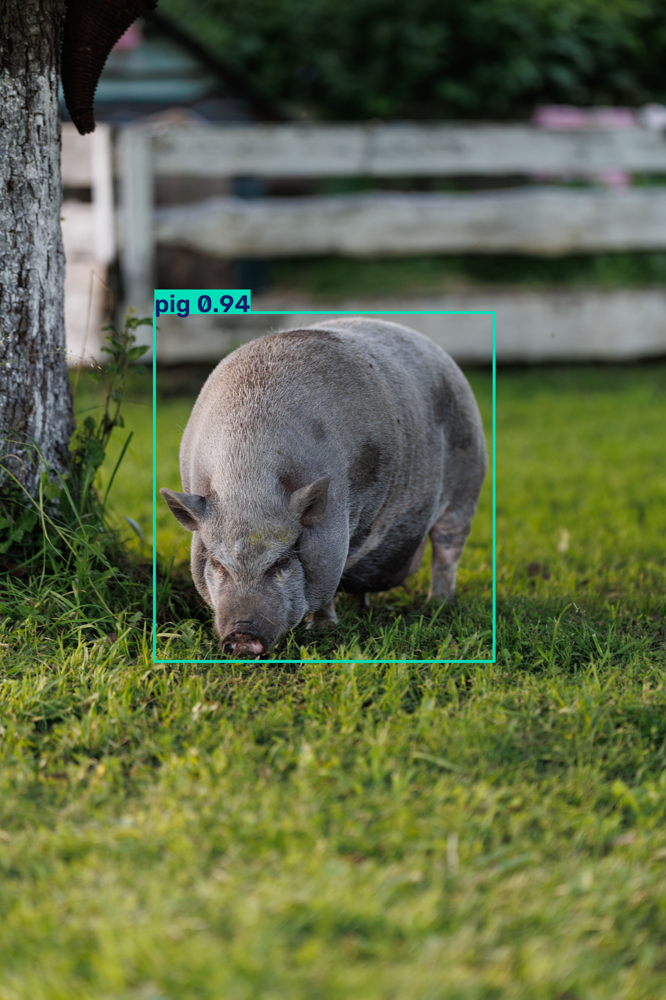
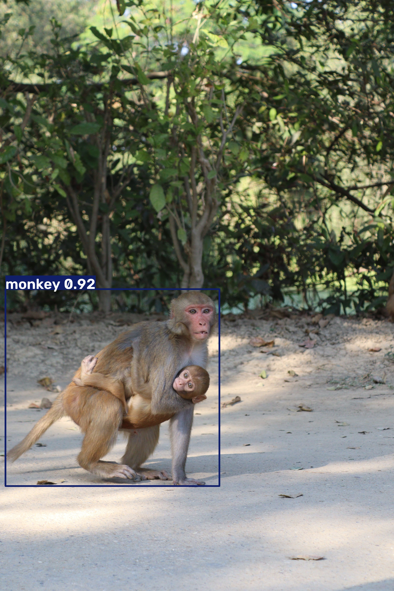
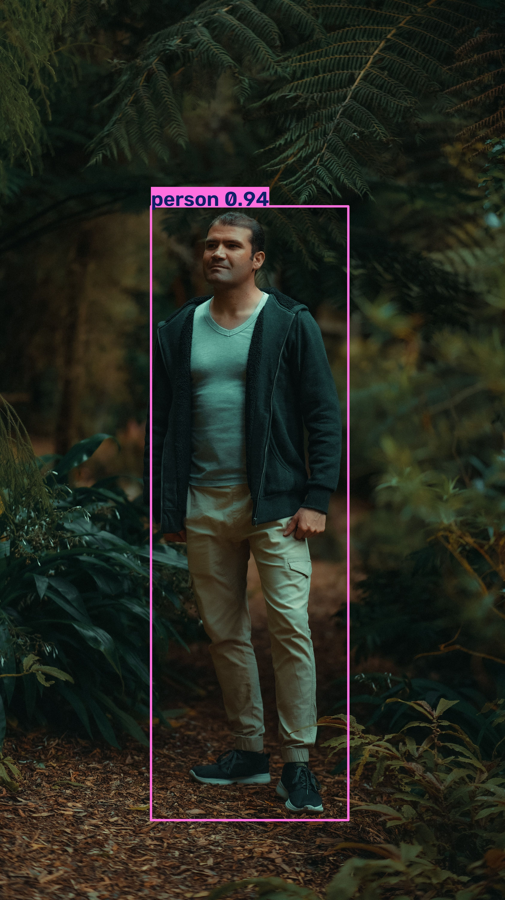

## 專案介紹 (Project Introduction)

本專案為六類別物件偵測研究之一部分，以 Ultralytics YOLOv11n 物件偵測模型為核心，建立包含熊（Bear）、貓（Cat）、狗（Dog）、人（Person）、猴子（Monkey）及豬（Pig）之六類別物件偵測模型。研究延續前期三類別物件偵測實驗，經由基礎模型建立、資料集擴充與訓練流程驗證後，進一步將偵測目標由三類別擴充至六類別，以建立更完整的多類別物件偵測環境。

本研究之主要目的為比較 YOLOv11n 與 YOLOv11s 兩種模型架構於相同六類別資料集與訓練條件下之物件偵測效能，分析不同模型規模在 Precision、Recall、mAP@50 及 mAP@50-95 等評估指標上的表現差異，並探討模型於不同類別目標上的辨識能力與定位精度。

本專案採用五折交叉驗證（5-Fold Cross Validation）進行模型訓練與效能評估，透過不同資料分割組合進行多次訓練與驗證，以降低單一資料切分所造成的評估偏差，並提升實驗結果之可靠性與代表性。本資料夾主要保存 YOLOv11n 優化版本之訓練結果，並作為後續與 YOLOv11s 模型進行效能比較之實驗依據。

## 研究目標 (Research Objectives)

本專案旨在建立一套具備良好偵測準確度與定位能力的六類別目標偵測模型，並透過五折交叉驗證（5-Fold Cross Validation）評估 YOLOv11n 模型在不同資料切分下的穩定性與泛化能力。

主要研究目標如下：

1. **建立六類別目標偵測模型**
   - 使用 YOLOv11n 進行狗（dog）、貓（cat）、熊（bear）、豬（pig）、猴（monkey）及人（person）六類目標的訓練與偵測。

2. **提升模型整體偵測效能**
   - Precision（P）達到 **90% 以上**。
   - Recall（R）達到 **90% 以上**。
   - mAP50 達到 **90% 以上**。
   - mAP50-95 達到 **80% 以上**。

3. **驗證模型穩定性與泛化能力**
   - 採用 **5-Fold Cross Validation**，將資料集分為五組不同的訓練與驗證組合。
   - 分析各 Fold 的 Precision、Recall、mAP50 及 mAP50-95，評估模型在不同資料分割下的效能變化。

4. **評估模型實際應用與部署可行性**
   - 以 YOLOv11n 輕量化模型為基礎，在兼顧模型偵測效能與運算效率的情況下，評估其後續部署於實際應用環境的可行性。
  
## 類別編號 (Class ID)

本專案共包含 6 個目標偵測類別，類別編號（Class ID）與對應名稱如下：

| Class ID | 類別名稱 | Class Name |
|---------:|----------|------------|
| 0 | 狗 | dog |
| 1 | 貓 | cat |
| 2 | 熊 | bear |
| 3 | 豬 | pig |
| 4 | 猴 | monkey |
| 5 | 人 | person |

## 資料集資訊 (Dataset Information)

本研究建立一套包含 **900 張影像**的六類別目標偵測資料集，涵蓋狗（dog）、貓（cat）、熊（bear）、豬（pig）、猴（monkey）及人（person）六個目標類別。各類別皆配置 150 張影像，以維持類別數量的均衡，降低因類別分布不均所造成的模型偏差。

### 資料集規模

| 類別 | Class ID | 英文名稱 | 影像數量 |
|------|---------:|----------|---------:|
| 狗 | 0 | dog | 150 |
| 貓 | 1 | cat | 150 |
| 熊 | 2 | bear | 150 |
| 豬 | 3 | pig | 150 |
| 猴 | 4 | monkey | 150 |
| 人 | 5 | person | 150 |
| **總計** | **0–5** | **6 Classes** | **900** |

### 資料標註

本研究使用 **Label Studio** 進行影像資料標註，建立六類別目標偵測所需的 Bounding Box 標註資料，格式如下:

| 欄位 | 說明 | 數值範圍 |
|---|---|---|
| **Class ID** | 目標類別編號 | 0–5 |
| **Center X** | Bounding Box 中心點 X 座標 | 0–1 |
| **Center Y** | Bounding Box 中心點 Y 座標 | 0–1 |
| **Width** | Bounding Box 寬度 | 0–1 |
| **Height** | Bounding Box 高度 | 0–1 |

YOLO 標註資料以單行格式儲存：

`Class ID  Center X  Center Y  Width  Height`

例如：

`0 0.523 0.481 0.356 0.612`

其中 `0` 代表 **dog**，其餘座標與尺寸資訊皆經過正規化（Normalization），數值介於 **0～1** 之間。

## 訓練參數 (Training Parameters)

本研究採用 **YOLOv11n** 作為基礎目標偵測模型，針對六類別資料集進行五折交叉驗證訓練。為確保各 Fold 實驗條件一致，五個 Fold 均採用相同的模型架構、影像尺寸、Batch Size 與訓練參數進行訓練。

### 模型與訓練設定

| 訓練參數 | 設定值 | 說明 |
|----------|--------|------|
| Model | YOLOv11n | 採用 YOLOv11 Nano 輕量化目標偵測模型 |
| Pretrained Weights | `yolo11n.pt` | 使用預訓練權重進行模型初始化 |
| Classes | 6 | dog、cat、bear、pig、monkey、person |
| Epochs | 100 | 設定最大訓練週期為 100 Epochs |
| Batch Size | 8 | 每次迭代處理 8 張影像 |
| Image Size | 640 × 640 | 模型輸入影像尺寸 |
| Device | GPU 0 | 使用 NVIDIA GPU 進行模型訓練 |
| Workers | 2 | 資料載入程序數 |
| Cache | False | 不使用資料快取，以降低額外記憶體使用 |
| AMP | True | 啟用 Automatic Mixed Precision，提升訓練效率 |
| Optimizer | Auto | 由 Ultralytics 自動選擇最佳化器 |
| Cosine LR | True | 啟用 Cosine Learning Rate Scheduler |
| Close Mosaic | 10 | 最後 10 個 Epoch 關閉 Mosaic 資料增強 |
| Classification Loss | 0.75 | 設定分類損失權重 |
| Cross Validation | 5-Fold | 採用五折交叉驗證進行模型效能評估 |
| Random State | 42 | 固定資料切分的隨機種子，以確保實驗可重現性 |

### 五折交叉驗證設定

本研究使用 `KFold` 進行五折交叉驗證，設定 `n_splits=5`、`shuffle=True` 及 `random_state=42`，將完整資料集隨機且可重現地切分為五組資料。

每一 Fold 約使用 **80% 資料作為訓練集，20% 作為驗證集**。五個 Fold 分別進行獨立模型訓練，並於訓練完成後取得各 Fold 的 Precision（P）、Recall（R）、mAP50 及 mAP50-95 等評估指標。

透過五個 Fold 的結果進行比較與平均，可降低單一資料切分對實驗結果造成的影響，並評估模型在不同資料分布下的穩定性與泛化能力。

### 訓練策略

為提升模型訓練效率與穩定性，本研究採用 YOLOv11n 預訓練權重 `yolo11n.pt` 作為模型初始化基礎，並搭配 Automatic Mixed Precision（AMP）降低訓練過程中的 GPU 記憶體使用量。

此外，使用 Cosine Learning Rate Scheduler 調整學習率，並於最後 10 個 Epoch 關閉 Mosaic Data Augmentation，使模型在訓練後期逐步適應較接近實際資料分布的影像特徵。

每完成一個 Fold 的模型訓練後，程式會釋放模型與 GPU 記憶體，並等待 60 秒後再進行下一 Fold，以降低長時間連續訓練造成的硬體負載。

## 資料夾說明 (Folder Structure)

本專案依照資料集建立、五折交叉驗證、模型訓練、模型評估與推論等研究流程進行檔案配置，以維持實驗流程的清晰性、可追蹤性與可重現性。

```text
YOLOv11n_6Categories/
│
├── auto_5fold.py
├── eval_conf.py
├── inference.py
│
├── fold1/
├── fold1.yaml
├── fold2/
├── fold2.yaml
├── fold3/
├── fold3.yaml
├── fold4/
├── fold4.yaml
├── fold5/
├── fold5.yaml
│
├── runs/
│
├── yolo11n.pt
├── yolo26n.pt
│
├── YOLOv11n(已微調超參數).png
├── YOLOv11n(未微調超參數).png
│
└── README.md
```

### 主要檔案說明

| 檔案 / 資料夾                    | 功能說明                               |
| --------------------------- | ---------------------------------- |
| `auto_5fold.py`             | 自動建立五折資料集，並執行 YOLOv11n 五折交叉驗證訓練    |
| `eval_conf.py`              | 評估不同 Confidence Threshold 下的模型偵測結果 |
| `inference.py`              | 使用訓練完成的模型進行影像推論與目標偵測               |
| `fold1/` ～ `fold5/`         | 五折交叉驗證所建立的獨立資料集                    |
| `fold1.yaml` ～ `fold5.yaml` | 各 Fold 對應的 YOLO 資料集設定檔，包含資料路徑與類別資訊 |
| `runs/`                     | 儲存模型訓練過程產生的訓練結果、評估資訊與模型權重          |
| `yolo11n.pt`                | YOLOv11n 預訓練模型權重，作為模型訓練的初始化權重      |
| `yolo26n.pt`                | 其他模型測試所使用的模型權重                     |
| `YOLOv11n(已微調超參數).png`      | YOLOv11n 進行超參數調整後的模型效能結果           |
| `YOLOv11n(未微調超參數).png`      | YOLOv11n 未進行超參數調整時的模型效能結果          |
| `README.md`                 | 專案研究目的、資料集、訓練方法、實驗結果與分析說明          |

### 五折資料結構

`auto_5fold.py` 會使用 **KFold** 將完整資料集切分為五個 Fold，每個 Fold 建立獨立的訓練集與驗證集。

```text
fold1/
├── images/
│   ├── train/
│   └── val/
└── labels/
    ├── train/
    └── val/
```

`fold2/` 至 `fold5/` 採用相同的資料結構。各 Fold 透過對應的 `.yaml` 設定檔提供 YOLO 模型訓練所需的資料路徑與六個目標類別資訊。

透過上述資料夾結構，可將**資料切分、模型訓練、模型評估與推論流程**清楚區分，提升整體研究實驗的可重現性與專案管理效率。


## 權重檔說明 (Model Weights)

本專案以 **YOLOv11n 預訓練權重 `yolo11n.pt`** 作為模型初始化基礎，並透過五折交叉驗證分別進行模型訓練。各 Fold 訓練完成後，由 Ultralytics YOLO 自動保存對應的模型權重。

| 權重檔          | 說明                                          |
| ------------ | ------------------------------------------- |
| `best.pt`    | 該 Fold 驗證過程中表現最佳的模型權重，主要用於後續模型評估與推論         |
| `last.pt`    | 該 Fold 最後一個訓練 Epoch 所保存的模型權重，可用於訓練狀態保存與後續續訓 |

### 五折模型權重

五折交叉驗證完成後，各 Fold 會分別保存獨立的模型權重，以確保不同資料切分下的模型結果能夠獨立評估。

```text
Fold_1/
└── weights/
    ├── best.pt
    └── last.pt

Fold_2/
└── weights/
    ├── best.pt
    └── last.pt

Fold_3/
└── weights/
    ├── best.pt
    └── last.pt

Fold_4/
└── weights/
    ├── best.pt
    └── last.pt

Fold_5/
└── weights/
    ├── best.pt
    └── last.pt
```

其中，各 Fold 的 **`best.pt`** 作為主要評估權重，用於後續 Confidence Threshold 評估、模型效能比較與影像推論。


## YOLOv11n 五折交叉驗證結果 (YOLOv11n 5-Fold Cross Validation Results)

為評估 YOLOv11n 模型於六類別目標偵測任務中的整體效能與穩定性，本研究採用 **5-Fold Cross Validation** 進行模型訓練與驗證。透過五組不同的訓練集與驗證集組合，分別取得各 Fold 的 Precision（P）、Recall（R）、mAP50 及 mAP50-95，並計算五個 Fold 的平均值作為整體模型效能指標。

### 五折交叉驗證結果

| Fold          | Precision (P) | Recall (R) |      mAP50 |   mAP50-95 |
| ------------- | ------------: | ---------: | ---------: | ---------: |
| Fold 1        |        0.9070 |     0.8810 |     0.9450 |     0.7830 |
| Fold 2        |        0.8920 |     0.9230 |     0.9510 |     0.7770 |
| Fold 3        |        0.8900 |     0.9480 |     0.9540 |     0.8170 |
| Fold 4        |        0.9530 |     0.8560 |     0.9220 |     0.7590 |
| Fold 5        |        0.8920 |     0.9360 |     0.9570 |     0.8010 |
| **5-Fold 平均** |    **0.9068** | **0.9088** | **0.9458** | **0.7874** |

### 整體結果

五折交叉驗證結果顯示，YOLOv11n 的平均 **Precision 為 0.9068、Recall 為 0.9088、mAP50 為 0.9458，以及 mAP50-95 為 0.7874**。

其中 Precision 與 Recall 均達到 **90% 以上**，mAP50 達到 **94.58%**，顯示模型具有良好的目標辨識能力與偵測效能；mAP50-95 則達到 **78.74%**，代表模型在較嚴格的 IoU 評估條件下仍具備一定的定位能力。

本次五折交叉驗證採用 **Confidence Threshold = 0.25（Default）** 進行評估，後續將進一步透過 Confidence Threshold 調整與模型評估，分析不同信心度門檻對模型 Precision、Recall 及整體偵測表現的影響。

## 效能分析 (Performance Analysis)

五折交叉驗證結果顯示，YOLOv11n 平均 **Precision 為 90.68%、Recall 為 90.88%、mAP50 為 94.58%、mAP50-95 為 78.74%**，四項指標皆達成本研究設定之效能目標。

其中，Fold 4 具有最高 Precision（95.30%），Fold 3 具有最高 Recall（94.80%）與 mAP50-95（81.70%），Fold 5 則具有最高 mAP50（95.70%）。整體而言，不同 Fold 間雖存在些微差異，但模型仍維持良好的偵測穩定性。

| 評估指標      |  研究目標 |       五折平均 |  結果 |
| --------- | ----: | ---------: | :-: |
| Precision | ≥ 90% | **90.68%** |  ✅  |
| Recall    | ≥ 90% | **90.88%** |  ✅  |
| mAP50     | ≥ 90% | **94.58%** |  ✅  |
| mAP50-95  | ≥ 75% | **78.74%** |  ✅  |

mAP50-95 相較於 mAP50 下降約 **15.84 個百分點**，顯示模型具有良好的目標辨識能力，但在較嚴格的 IoU 條件下，Bounding Box 定位精度仍具有改善空間。

> **綜合而言，YOLOv11n 已達成四項主要效能目標，並具有良好的偵測效能與跨資料切分穩定性。**

## 信心度閾值分析 (Confidence Threshold Analysis)

本研究比較 **Confidence Threshold = 0.25 與 0.26** 的模型評估結果，以分析信心度閾值調整對 YOLOv11n 偵測效能的影響。其中 0.25 為原始評估設定，並進一步將閾值調整為 0.26 進行比較。

### Confidence Threshold = 0.26

| Fold          | Precision (P) | Recall (R) |      mAP50 |   mAP50-95 |
| ------------- | ------------: | ---------: | ---------: | ---------: |
| Fold 1        |         0.916 |      0.881 |      0.888 |      0.735 |
| Fold 2        |         0.908 |      0.923 |      0.920 |      0.759 |
| Fold 3        |         0.909 |      0.940 |      0.927 |      0.793 |
| Fold 4        |         0.921 |      0.889 |      0.879 |      0.724 |
| Fold 5        |         0.902 |      0.943 |      0.933 |      0.784 |
| **5-Fold 平均** |    **0.9113** | **0.9152** | **0.9095** | **0.7588** |

### Confidence Threshold 比較

| Confidence Threshold |  Precision |     Recall |      mAP50 |   mAP50-95 |
| -------------------: | ---------: | ---------: | ---------: | ---------: |
|             **0.25** |     0.9068 |     0.9088 | **0.9458** | **0.7874** |
|             **0.26** | **0.9113** | **0.9152** |     0.9095 |     0.7588 |

將 Confidence Threshold 由 **0.25 調整為 0.26** 後，Precision 與 Recall 分別由 **90.68% 提升至 91.13%**、**90.88% 提升至 91.52%**；然而，mAP50 與 mAP50-95 則分別下降至 **90.95%** 與 **75.88%**。

結果顯示，0.26 在 Precision 與 Recall 上略有提升，但 0.25 在 mAP50 與 mAP50-95 上具有較佳表現。

> **綜合四項評估指標，本研究採用 Confidence Threshold = 0.25 作為後續模型評估與比較的主要設定。**

## 模型推論結果 (Inference Results)

為驗證 YOLOv11n 模型於實際影像中的目標偵測能力，本研究使用五折交叉驗證訓練所得之模型權重進行影像推論，測試模型對狗、貓、熊、豬、猴及人六類目標的辨識效果。

<table>
  <tr>
    <td align="center"></td>
    <td align="center"></td>
    <td align="center"></td>
  </tr>
  <tr>
    <td align="center"><b>Dog</b></td>
    <td align="center"><b>Cat</b></td>
    <td align="center"><b>Bear</b></td>
  </tr>
  <tr>
    <td align="center"></td>
    <td align="center"></td>
    <td align="center"></td>
  </tr>
  <tr>
    <td align="center"><b>Pig</b></td>
    <td align="center"><b>Monkey</b></td>
    <td align="center"><b>Person</b></td>
  </tr>
</table>

模型能夠於測試影像中辨識六類目標，並輸出對應的 **Bounding Box、類別名稱及 Confidence Score**，顯示 YOLOv11n 已具備六類別目標之實際影像偵測能力。

> **實際推論結果顯示，模型能有效辨識狗、貓、熊、豬、猴及人等六類目標，可作為後續模型比較與實際應用之基礎。**

## 結論 (Conclusion)

本研究以 **YOLOv11n** 建立狗、貓、熊、豬、猴及人六類別目標偵測模型，並透過 **5-Fold Cross Validation** 評估模型於不同資料切分下的偵測效能與穩定性。

五折平均結果顯示，Precision 為 **90.68%**、Recall 為 **90.88%**、mAP50 為 **94.58%**、mAP50-95 為 **78.74%**，四項指標皆達成本研究所設定之效能目標，顯示 YOLOv11n 具有良好的目標辨識能力與泛化表現。

在信心度閾值比較中，Confidence Threshold = 0.26 雖使 Precision 與 Recall 略為提升，但 mAP50 與 mAP50-95 相較於 0.25 有所下降。因此，綜合四項評估指標，本研究採用 **Confidence Threshold = 0.25** 作為後續模型評估與推論設定。

最後，本研究將依據五折交叉驗證所確立的 YOLOv11n 模型設定，使用完整資料集進行 **最終模型（Final Model）訓練**，並採用 **Confidence Threshold = 0.25** 進行最終效能評估與推論測試。完成模型驗證後，將進一步建立**最終部署模型（Deployment Model）**，作為後續實際影像偵測系統與邊緣運算設備部署之模型基礎。

> **綜合實驗結果，YOLOv11n 已達成本研究設定之六類別目標偵測效能需求。後續將完成最終模型訓練與部署模型建立，並進一步與 YOLOv11s 進行效能比較，以評估不同模型規模於偵測準確度、定位能力、運算效率及實際部署可行性上的差異。**
